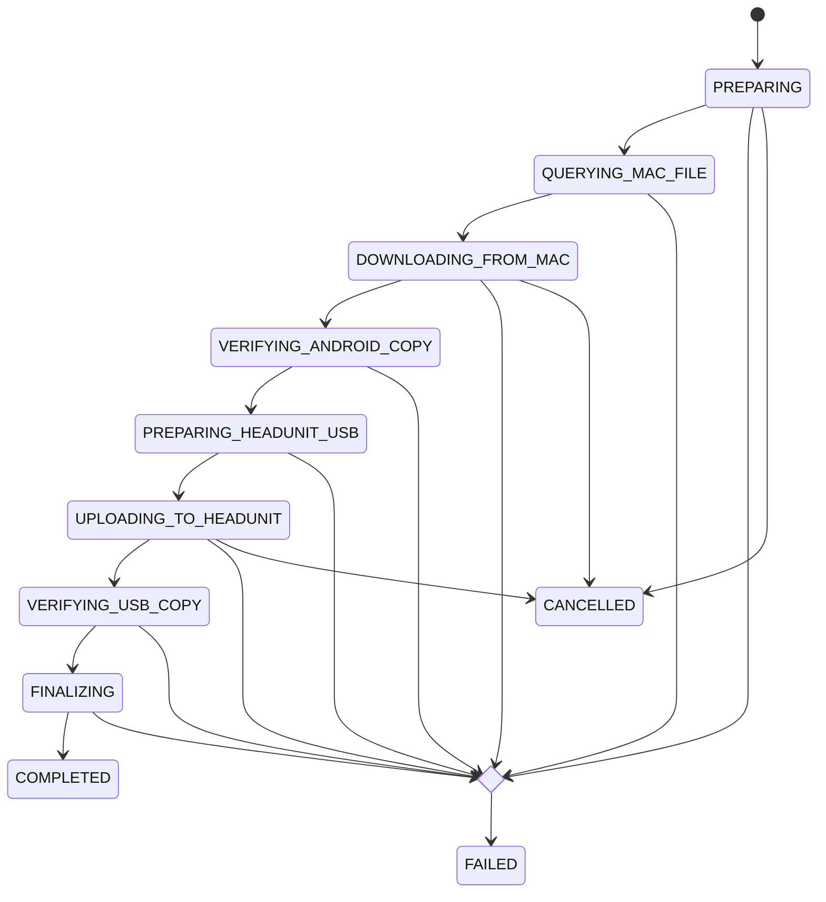

# API, Data, And State Contracts

## Mac-Agent RPC

**Implemented.** RPC uses one newline-delimited JSON object per connection. Request arguments are strings.

```json
{"command":"start","arguments":{"deviceIdPlaceholder":"<MOBILE_DEVICE_PLACEHOLDER_DEVICE_ID_PLACEHOLDER>","name":"CaptureSessionPlaceholder_Wireless","requestId":"<REQUEST_ID>"}}
```

```json
{
  "ok": true,
  "result": {
    "jobId": "<JOB_UUID>",
    "captureId": "<CAPTURE_UUID>",
    "deviceIdPlaceholder": "<MOBILE_DEVICE_PLACEHOLDER_DEVICE_ID_PLACEHOLDER>",
    "outputPath": "<AGENT_CAPTURE_PATH>",
    "liveJSONPath": "<AGENT_LIVE_NDJSON_PATH>",
    "state": "RUNNING",
    "activity": {"state": "WAITING_FOR_ACTIVITY", "captureBytes": 0, "observedLiveEvents": 0}
  }
}
```

All failures use the same envelope shape:

```json
{"ok":false,"error":"Capture job was not found"}
```

| Command | Required arguments | Result | Implemented error conditions |
| --- | --- | --- | --- |
| `health` | none | Agent version, CAPTURE_TOOL_PLACEHOLDER path/availability, supported command names | RPC decode/encoding and listener errors |
| `capabilities` | none | CAPTURE_TOOL_PLACEHOLDER/caffeinate availability and `wifi`/`bluetooth` transports | RPC errors |
| `devices` | none | `wifi` and `bluetooth` arrays of CAPTURE_TOOL_PLACEHOLDER output lines | CAPTURE_TOOL_PLACEHOLDER unavailable |
| `preflight` | none | CAPTURE_TOOL_PLACEHOLDER availability, free-space values, active-job flag, device lines | `ok:false` if unavailable, storage insufficient, or active job |
| `jobs` | none | Persisted jobs ordered newest first | RPC errors |
| `start` | `deviceIdPlaceholder`; optional `name`, `requestId` | Capture job | invalid DEVICE_ID_PLACEHOLDER/request ID, CAPTURE_TOOL_PLACEHOLDER unavailable, low space, active job |
| `status` | `job` UUID | Capture job | invalid or unknown job ID |
| `stop` | `job` UUID | Updated capture job | invalid/unknown ID, job not running |

DEVICE_ID_PLACEHOLDERs permit ASCII letters, digits, and hyphen, max 64 characters. Request IDs add underscore. The Android client also requires UUID-shaped job IDs before invoking CLI commands.

### Capture job fields

`CaptureJob` contains stable IDs, output and live JSON paths, state, activity, timestamps, owned PID while live, exit code, last error, validation, and optional artifact metadata. `CaptureSessionPlaceholderValidation` states are `VALID`, `EMPTY`, `EXPORT_FAILED`, `CORRUPT`, and `UNVERIFIED`. Artifact metadata carries byte count, optional SHA-256, completion time, and agent version.

## CLI Contract

The installed CLI prints pretty JSON to stdout for RPC commands and exits nonzero when `ok` is false. It returns exit status 2 on local usage/transport errors. The local validation command is:

```bash
tracemate-agent validate <CAPTURE_FILE>
```

It does not go through RPC. Its input file path must be supplied by the local caller; Android does not expose arbitrary validation paths.

## Discovery Identity

The Mac identity endpoint returns:

```json
{"id":"<AGENT_UUID>","protocolVersion":1}
```

The mDNS TXT record contains equivalent `id` and `protocol` values. Android validates these values before accepting a discovered endpoint. Discovery is **Implemented** but Android 13+ dependent.

## Android Transfer States

### COREDUMP USB transfer

**Implemented.** `UsbTransferCoordinatorState` is `Idle`, `Running`, or `Completed`. A persisted `ActiveTransferSnapshot` includes selected archives, their sparse result records, mount/session information, current work, cancel intent, and recovery details. Only `requestCancel()` cancels the batch; UI destruction does not.

Remote worker status tokens include `RUNNING`, `SUCCESS:<path>`, `ALREADY_PRESENT:<path>`, `FAILED:<reason>`, and `CANCELLED`. The exact head-unit commands are intentionally not a public generic API; they are internal predefined operations in `UsbShellCommandBuilder`.

### CAPTURE_TOOL_PLACEHOLDER artifact bridge

**Implemented.** The persisted Android snapshot has job ID, status, active phase, selected remote paths, current file, byte progress, and error. Job status is `RUNNING`, `COMPLETED`, `FAILED`, `CANCELLED`, or `INTERRUPTED`.



On process restart, a `RUNNING` bridge snapshot becomes `INTERRUPTED`; SCP has no resume contract, so the user must explicitly restart. Cleanup is best effort: Android staging removes failed/cancelled download directories and the head-unit bridge removes destination `.partial` files when it can reconnect.

## External SSH And ADB Use

SSH and ADB are implementation channels, not general remote-execution APIs. The Android app exposes only predefined workflows. SSH executes configured diagnostics, firewall operations, Mac CLI commands, and bounded file-transfer support. The raw ADB implementation sends `CNXN`, `OPEN`, `OKAY`, `WRTE`, and `CLSE` packets and wraps shell commands with an exit-code marker.

The configuration-dependent values are head-unit/Mac SSH hosts and ports, head-unit ADB port, expected head-unit paths and tools, and USB mount layout. Do not infer supported values from old documents or examples; configure the target environment and validate it through the UI.
