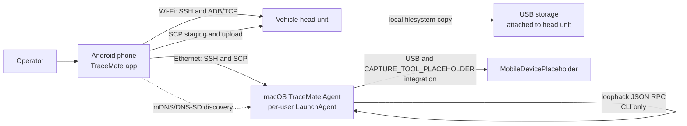

# Architecture

## System Context



The dashed discovery path is implemented on Android 13 and later. It discovers the Mac's `MAC_AGENT_DISCOVERY_FQDN_PLACEHOLDER` service, validates its identity endpoint, and persists the discovered address. It is not the Mac-agent RPC path: RPC remains bound to loopback on the Mac.

## Components

| Component | Responsibility | Status |
| --- | --- | --- |
| Compose UI and navigation | Renders state and forwards explicit actions | **Implemented** |
| Android ViewModels | Coordinate UI workflows with `StateFlow` and coroutines | **Implemented** |
| Android repositories | Wi-Fi/Ethernet selection, JSch SSH, SCP, ADB, settings, transfers | **Implemented** |
| Head-unit shell worker | Performs long-running COREDUMP USB copies in its own process group | **Implemented** |
| Mac agent | Starts, monitors, stops, validates, and persists CAPTURE_TOOL_PLACEHOLDER capture jobs | **Implemented** |
| Mac agent CLI | Converts commands to loopback JSON RPC requests and prints JSON | **Implemented** |
| Persistent ADB connection manager | Reuses authenticated ADB sessions | **Planned** |

### Android layering

```text
Compose screens -> StateFlow -> ViewModels -> suspend repository/coordinator calls
                                            -> Wi-Fi / SSH / SCP / ADB / DataStore
```

There is no dependency-injection framework. Factories construct screen dependencies; `ServiceLocator` owns application-scoped Wi-Fi, USB-transfer, CAPTURE_TOOL_PLACEHOLDER-transfer, Mac-discovery, and snapshot services. Long-running USB and CAPTURE_TOOL_PLACEHOLDER-file transfers use their own `SupervisorJob` scopes rather than a ViewModel scope.

### Mac-agent layering

```text
tracemate-agent CLI -> loopback TCP JSON RPC -> CaptureController actor
                                                  -> CAPTURE_TOOL_PLACEHOLDER process + live NDJSON monitor
                                                  -> JobRepository JSON files
```

## Control And Data Flows

### Head-unit connection validation

1. The operator connects the phone to the target Wi-Fi using Android's system-mediated QR/camera flow.
2. `ConnectivityManager` selects the Wi-Fi `Network`; the app does not bind the entire process to it.
3. Automatic validation runs SSH, scoped firewall preparation, ADB TCP reachability, ADB `CNXN` handshake, and ADB shell in order.
4. Each outcome is visible in the Home screen. A failure stops the sequence and does not claim later steps succeeded.

### CAPTURE_TOOL_PLACEHOLDER capture

1. Android obtains a Mac address from validated mDNS discovery or configured fallback settings and uses an Ethernet-bound SSH socket.
2. Android invokes the installed Mac CLI through SSH. The CLI sends local JSON RPC to the loopback agent.
3. The agent validates the DEVICE_ID_PLACEHOLDER and request ID, rejects a concurrent unresolved job, starts CAPTURE_TOOL_PLACEHOLDER, and persists the job before launch.
4. The agent monitors file growth and completed NDJSON records. Android polls `status` through the CLI while a capture is active.
5. On stop, the agent writes `stop` to the owned CAPTURE_TOOL_PLACEHOLDER stdin, waits for exit, validates the final artifact, and records `COMPLETED` or `FAILED`.

### CAPTURE_TOOL_PLACEHOLDER artifact export

1. An operator selects completed `.capture_tool_placeholder` files exposed by the Android capture UI.
2. Android downloads each selected file from the Mac over Ethernet using SCP into app-private staging.
3. Android verifies byte count and SHA-256 when available, then SCP-uploads to a writable head-unit USB mount over Wi-Fi.
4. The head-unit destination uses a `.partial` name, verifies size and SHA-256, then atomically renames to the final file.
5. This is explicitly store-and-forward. The Mac has no direct head-unit transfer route in the implementation.

### COREDUMP USB export

Android sends predefined ADB shell commands. The head unit discovers archives, launches a `setsid` worker, stages output in a `.partial` directory, and atomically renames it after success. Android persists a snapshot before work and can inspect or reattach to a surviving remote worker after an app restart. A Wi-Fi/ADB communication loss is treated as recoverable; other infrastructure failures end the batch visibly.

## Channels And Ports

| Channel | Verified use | Value | Notes |
| --- | --- | --- | --- |
| Head-unit SSH | Diagnostics, firewall, CAPTURE_TOOL_PLACEHOLDER USB preparation | Configurable; default port `22` | JSch password authentication; target-bound to selected Wi-Fi. |
| Head-unit ADB/TCP | Handshake, shell, E-Release, COREDUMP export | Port `5555` in current code | Fresh socket per operation; no RSA/AUTH support. |
| Mac SSH/SCP | Agent CLI and CAPTURE_TOOL_PLACEHOLDER-file transfers | Configurable; default port `22` | Target-bound to selected Ethernet. |
| Mac RPC | Agent control | `MAC_AGENT_RPC_ENDPOINT_PLACEHOLDER` | Never intended for Android network access. |
| mDNS/DNS-SD | Mac discovery identity | Dynamic listener port | `MAC_AGENT_DISCOVERY_FQDN_PLACEHOLDER` service; the port is discovered, not configured. |
| USB | Export destination | Mount and filesystem are head-unit dependent | Detected by predefined head-unit shell logic. |

Device addresses, usernames, paths, and firewall chain names are configuration or implementation details, not portable deployment values. Use placeholders such as `<HEAD_UNIT_HOST>` in operational examples.

## Trust Boundaries

- Android-to-head-unit Wi-Fi and Android-to-Mac Ethernet are separate paths. SSH repositories fail when the required selected `Network` is unavailable rather than silently using Android's default route.
- Android passwords are encrypted at rest with Android Keystore AES-GCM; other settings are DataStore values.
- Current Android JSch configuration disables strict SSH host-key checking. This is a controlled-environment compromise, not a secure production posture.
- Mac RPC is loopback-only. SSH is the remote authorization boundary for the installed CLI, and the agent accepts only validated DEVICE_ID_PLACEHOLDERs, request IDs, job IDs, and server-generated paths.
- Head-unit firewall modification, USB writes, CAPTURE_TOOL_PLACEHOLDER start/stop, and transfer cancellation require an explicit UI action. Automatic Wi-Fi validation includes firewall preparation, so it changes head-unit firewall state after the user initiated the connection workflow; this must be understood by operators.
- The legacy debug ADB-port action is broader than scoped firewall preparation and is documented as deprecated in [Limitations](limitations.md).
