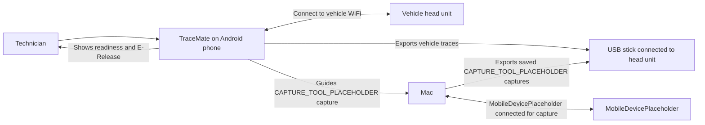
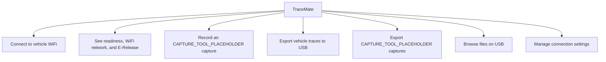

# System Overview

## What TraceMate Helps With

A technician uses TraceMate on an Android phone while working with a vehicle head unit. The phone connects to the vehicle WiFi. Once the connection is ready, the technician can export vehicle traces to a USB stick. For an CAPTURE_TOOL_PLACEHOLDER capture, the phone also guides work involving a Mac and an MobileDevicePlaceholder.

The user does not need to understand how the app checks connections or moves files. The UI should only make the current readiness and next action clear.

## User-Facing Capabilities

## Simplified Product Rules

| Situation | What the UI should do |
|---|---|
| Phone is not on the vehicle WiFi | Direct the user to WiFi Setup. |
| Phone connects to vehicle WiFi | Automatically check readiness, then show the E-Release. |
| Connection is not ready | Explain the problem in plain language and keep dependent actions unavailable. |
| Connection is ready | Enable USB-related actions. |
| CAPTURE_TOOL_PLACEHOLDER capture is not active | Enable Start CAPTURE_TOOL_PLACEHOLDER Capture and disable Stop CAPTURE_TOOL_PLACEHOLDER Capture. |
| CAPTURE_TOOL_PLACEHOLDER capture is active | Disable Start CAPTURE_TOOL_PLACEHOLDER Capture and enable Stop CAPTURE_TOOL_PLACEHOLDER Capture. |
| A destructive action is requested | Ask for confirmation before proceeding. |

The exact visual design is open. The behavior and the hierarchy above are required.
