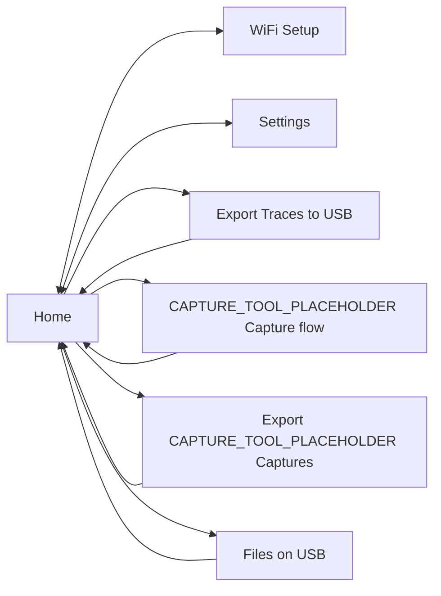
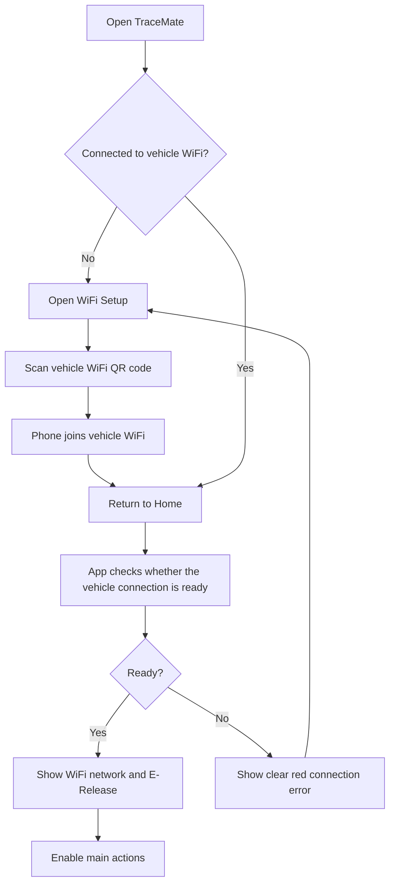

# Navigation And Primary Journeys

## App Navigation

Home is the operational center of the app. WiFi Setup and Settings are top-level destinations. Export and file-management pages are reached from Home because they are only useful when the vehicle connection is ready.

## First-Time Or Reconnection Journey

## What Is Always Available

| Area | Availability |
|---|---|
| Home | Always available. |
| WiFi Setup | Always available. |
| Settings | Always available. |
| Start/Stop CAPTURE_TOOL_PLACEHOLDER Capture | Always visible; enabled state depends on capture state and readiness. |
| Export Traces to USB | Available only after a successful vehicle readiness check. |
| Export CAPTURE_TOOL_PLACEHOLDER Captures | Available only after a successful vehicle readiness check. |
| Files on USB | Available only after a successful vehicle readiness check. |

The bottom navigation may contain Home, WiFi Setup, and Settings. Do not make technical diagnostics or export pages permanent bottom-navigation destinations.
