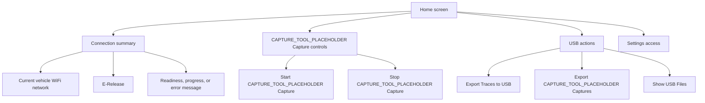
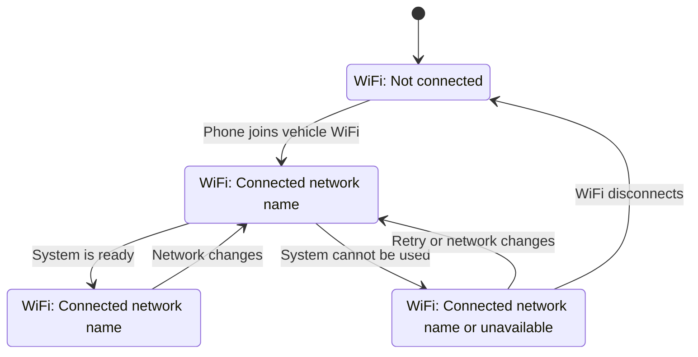
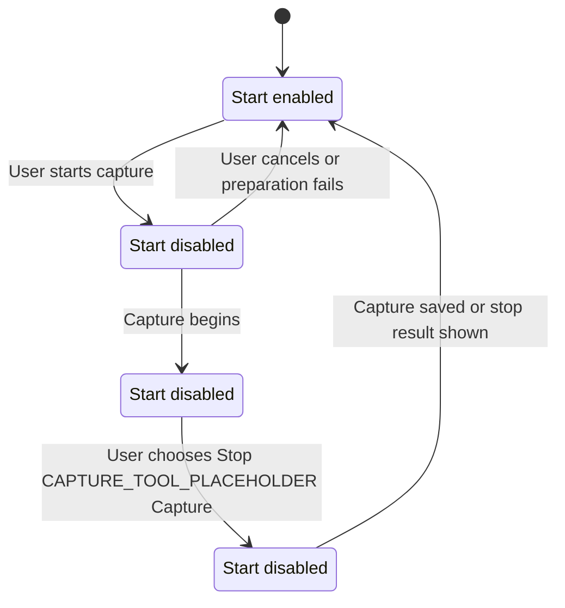

# Home And Status

## Role Of The Home Screen

The Home screen answers three questions immediately:

1. Am I connected to the correct vehicle WiFi?
2. Is the system ready to use?
3. What can I do now?

The screen should not expose technical connection steps. Internally, the app performs several checks; the user sees a single understandable readiness state.

## Recommended Content Hierarchy

## Connection Summary States

## Status And Error Rules

Place the status area directly below the WiFi network and E-Release. This is the first place a technician looks when an action is unavailable.

| State | Color | Meaning | Design requirement |
|---|---|---|---|
| Ready | Green | The relevant workflow can continue. | Keep it concise; do not dominate the screen. |
| In progress | Neutral or brand color | The app is checking or processing. | Show a visible progress indicator and plain-language label. |
| Mac-related issue | Yellow / amber | The vehicle connection is usable, but an CAPTURE_TOOL_PLACEHOLDER/Mac/MobileDevicePlaceholder step needs attention. | Explain the user action needed. |
| Any other issue | Red | A required connection or action failed. | Explain what happened and give a next step. |

Examples of appropriate copy:

- Green: `Ready to export traces.`
- Neutral: `Checking vehicle connection...`
- Yellow: `No MobileDevicePlaceholder found. Check the cable, unlock the MobileDevicePlaceholder, and confirm trust.`
- Red: `The vehicle connection is not ready. Check the selected WiFi network and try again.`
- Red: `E-Release could not be read.`

Do not show internal error names, command output, or protocol terminology in these messages.

## CAPTURE_TOOL_PLACEHOLDER Button Availability

Both buttons must always be visible. Their enabled states are exact opposites.

Stopping should show a confirmation dialog because it ends the active recording. The dialog must offer a clear choice to keep recording or stop the capture.
