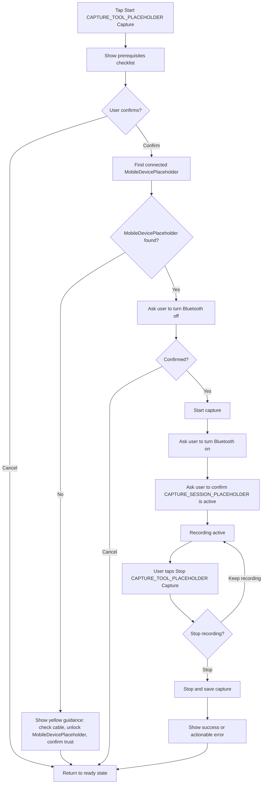
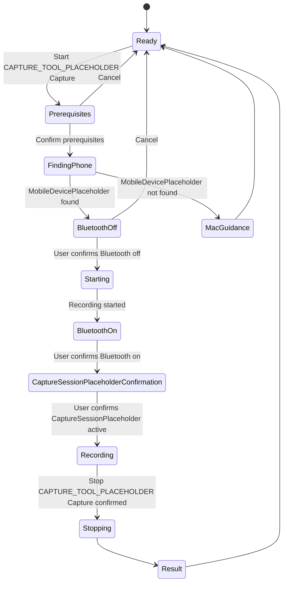

# CAPTURE_TOOL_PLACEHOLDER Capture Journey

## Purpose

An CAPTURE_TOOL_PLACEHOLDER capture records information while CAPTURE_SESSION_PLACEHOLDER is used. The technician follows the instructions on the Android phone while the MobileDevicePlaceholder is connected to a Mac.

The design should make this a calm, linear checklist. The user should only see the current instruction and the next required confirmation.

## Prerequisites The User Confirms

- The MobileDevicePlaceholder is connected to the Mac by cable.
- The MobileDevicePlaceholder is unlocked and trusts the Mac.
- The MobileDevicePlaceholder is connected to the vehicle WiFi.
- Required capture profiles/tools are already installed.

The UI does not need to explain how these tools work. It should state the prerequisite in user language and allow the user to confirm or cancel.

## Guided Capture Flow

## Screen-State Model

## Design Requirements

| State | Required UI |
|---|---|
| Preparation step | Short instruction, relevant context, Confirm and Cancel actions. |
| Finding or starting | Clear progress state. Do not show technical detail. |
| MobileDevicePlaceholder/Mac problem | Yellow error below the connection summary, plus a concise recovery instruction in the capture flow. |
| Recording active | Persistent, unmistakable recording state; Start disabled and Stop enabled. |
| Stop confirmation | Explain that recording will end; offer `Keep recording` and `Stop capture`. |
| Result | State whether the capture was saved. If not, state the next action. |

Suggested progress labels:

- `Checking capture prerequisites...`
- `Looking for the connected MobileDevicePlaceholder...`
- `Starting capture...`
- `Recording active`
- `Saving capture...`
