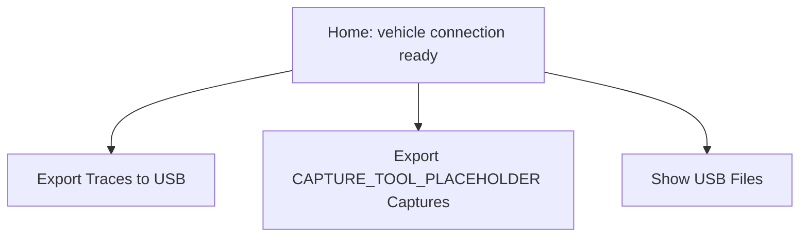
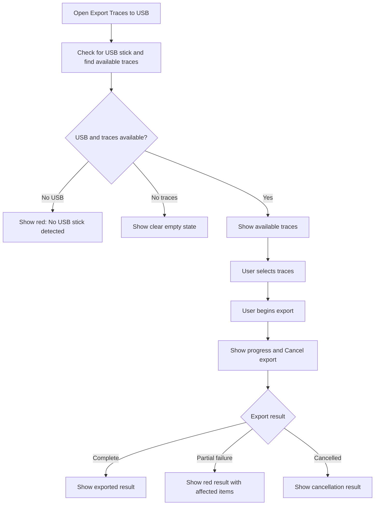
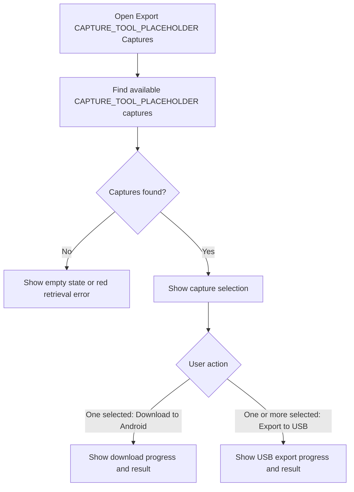
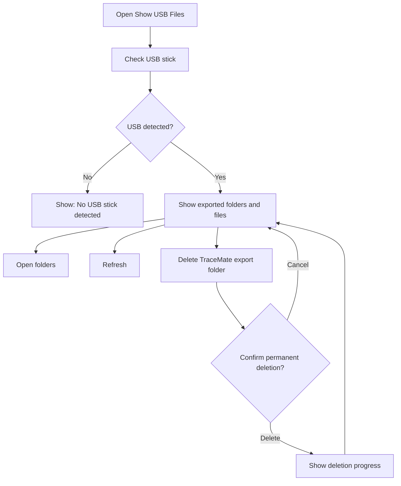

# USB Export And File Management

## Overview

Once the vehicle connection is ready, Home offers three USB-related actions:

All USB actions must clearly indicate when no USB stick is detected, when a transfer is active, and whether the action completed.

## Export Traces To USB

Vehicle traces are collected from the head unit and copied directly to a USB stick connected to the head unit.

### Trace Export Design Requirements

- Show a discovery/loading state before the selection list appears.
- Allow the user to select one or more available traces.
- Clearly identify traces already present on USB and prevent unnecessary duplicate selection.
- Show progress while exporting.
- Allow explicit cancellation while exporting.
- If the user tries to leave during export, ask whether to continue exporting or cancel and leave.
- Make the final result understandable at a glance: completed, partially completed, failed, or cancelled.

## Export CAPTURE_TOOL_PLACEHOLDER Captures

CAPTURE_TOOL_PLACEHOLDER captures are saved on the Mac after recording. The user can select captures and either download a single capture to the Android phone or export selected captures to USB.

## Files On USB

This is a simple browser for files previously exported by TraceMate.

Deletion is permanent. The confirmation dialog must say what will be deleted and that it cannot be undone.

## Shared USB States

| State | User-facing treatment |
|---|---|
| Checking | Loading indicator and a plain-language message. |
| No USB | Red or clear empty/error state with guidance to connect a USB stick. |
| USB not writable | Red error explaining that another writable USB stick is required. |
| No files / no traces | Informative empty state, not a technical error. |
| In progress | Progress indicator, current operation, and cancel option where safe. |
| Completed | Clear completion message and a way to return. |
| Failed | Red, actionable error without technical logs. |
