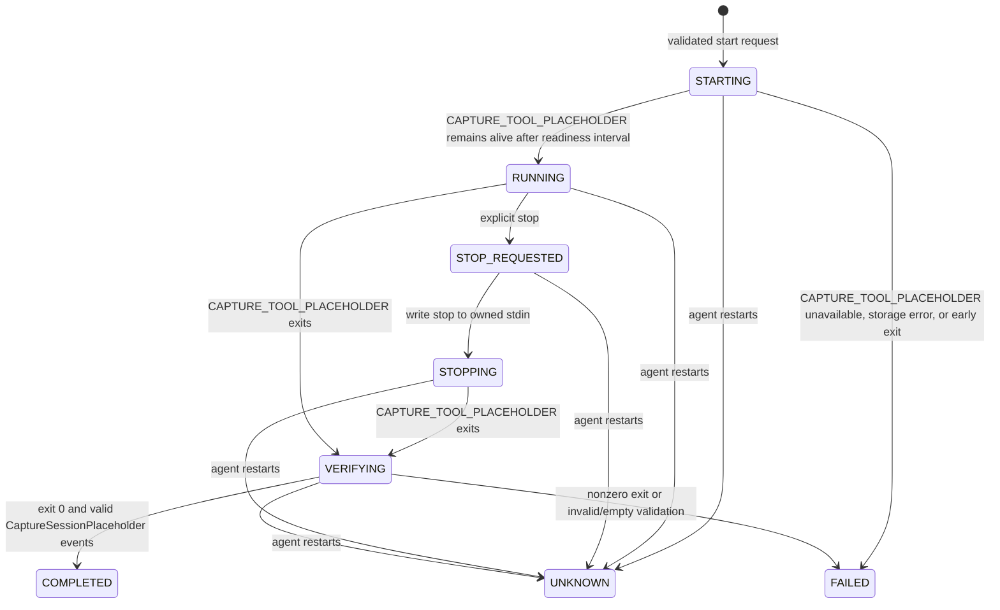

# macOS TraceMate Agent

## Scope

The Mac agent is **Implemented** as a Swift package for macOS 13 or later. It manages one CAPTURE_TOOL_PLACEHOLDER capture at a time for the logged-in dedicated macOS user. It is a per-user LaunchAgent, not a system daemon and not a root service.

| Package target | Type | Responsibility |
| --- | --- | --- |
| `TraceMateCore` | Library | Models, RPC server/client, capture controller, persistence, validator, identity server |
| `TraceMateAgent` | Executable | `tracemate-agent` command-line entry point |
| `TraceMateCoreTests` | Test target | Infrastructure, persistence, validation, and timeout coverage |

## Lifecycle

`tracemate-agent serve` creates the capture controller, starts a loopback RPC listener, and starts an mDNS identity server. The supplied `MAC_AGENT_LAUNCH_AGENT_PLACEHOLDER` LaunchAgent has `RunAtLoad` and `KeepAlive`; it runs the installed binary using the current user's home directory.

The supplied release installer builds the release binary, installs it with mode `700`, installs the LaunchAgent plist with mode `600`, bootstraps/kickstarts it, then runs `health`. See [Operations](operations.md) for exact verified commands.

**Partially implemented operational prerequisite:** a graphical session for the dedicated user must exist. Automatic login, FileVault, CAPTURE_TOOL_PLACEHOLDER/MobileDevicePlaceholder trust prompts, and power configuration are environment decisions that source review cannot validate. The existing `mac-agent/docs/InitialHeadlessSetup.md` contains stale claims and should not be used as the primary guide.

## RPC And CLI

The RPC service binds to `MAC_AGENT_RPC_ENDPOINT_PLACEHOLDER`. Each connection accepts one UTF-8 JSON request terminated by newline, up to 4096 bytes, and returns one newline-terminated JSON response. The CLI is the supported remote entry point: Android SSH runs the installed CLI, and the CLI contacts loopback RPC with a 10-second deadline.

| CLI command | RPC command | Status |
| --- | --- | --- |
| `health` | `health` | **Implemented** |
| `capabilities` | `capabilities` | **Implemented** |
| `devices` | `devices` | **Implemented** |
| `preflight` | `preflight` | **Implemented** |
| `jobs` | `jobs` | **Implemented** |
| `start --deviceIdPlaceholder ID [--name NAME] [--requestId ID]` | `start` | **Implemented** |
| `status --job UUID` | `status` | **Implemented** |
| `stop --job UUID` | `stop` | **Implemented** |
| `validate FILE` | local validator, no RPC | **Implemented engineering diagnostic** |

The current Android client uses health, jobs, start, status, and stop. The agent exposes capabilities, devices, and preflight, but Android does not currently surface them as a complete operator flow: **Partially implemented**.

## Capture Lifecycle

The controller validates a restricted DEVICE_ID_PLACEHOLDER and optional idempotency key, checks CAPTURE_TOOL_PLACEHOLDER executability and configured free space, and rejects another unresolved job. It persists the job before starting CAPTURE_TOOL_PLACEHOLDER. CAPTURE_TOOL_PLACEHOLDER is launched with Wi-Fi and Bluetooth transports and CaptureSessionPlaceholder/iAP2 protocols; stdout and stderr go to one job log. A `caffeinate -i -m` child is used when available while a capture runs.

The monitor periodically records capture/live-file growth and reads only complete new NDJSON lines. Activity is `WAITING_FOR_ACTIVITY`, `ACTIVE`, `IDLE`, `NO_CAPTURE_SESSION_PLACEHOLDER_ACTIVITY`, or `STOPPED`. Activity is diagnostic; it does not itself make a capture successful. Success requires CAPTURE_TOOL_PLACEHOLDER exit code zero and `VALID` final CaptureSessionPlaceholder Session export.

Stop is scoped to the owned process: the agent writes `stop` to its retained stdin and later sends process termination after the configured grace period only if that process remains alive. It does not use a broad process-name kill.

## Persistence, Output, And Recovery

The production root is `~/Library/Application Support/TraceMate`; `TRACEMATE_ROOT` changes only the root for a development invocation. `TRACEMATE_CAPTURE_TOOL_PLACEHOLDER_PATH` overrides the CAPTURE_TOOL_PLACEHOLDER executable path.

| Artifact | Location relative to root | Permissions/behavior |
| --- | --- | --- |
| Identity | `identity.json` | Mode `600`; stable UUID and protocol version for mDNS identity. |
| Job records | `state/jobs/<job-id>.json` | Mode `600`; atomically written. |
| Logs | `logs/jobs/<job-id>.log` | Mode `600`; log count is bounded by configuration. |
| Live export | `live/<capture-id>.ndjson` | Agent observes complete records incrementally. |
| Final validation export | `exports/<capture-id>/capture_session_placeholder-session.json` | Used to determine validation state. |
| Capture artifact | Production default: `~/CAPTURE_TOOL_PLACEHOLDER_CAPTURE_DIRECTORY_PLACEHOLDER/<safe-stem>.capture_tool_placeholder` | Capture directory is mode `700`; artifact includes byte count and SHA-256 when available. It is outside the agent state root. |

On agent construction, persisted `STARTING`, `RUNNING`, `STOP_REQUESTED`, `STOPPING`, and `VERIFYING` records become `UNKNOWN`, because the agent cannot safely recover ownership of CAPTURE_TOOL_PLACEHOLDER stdin. `UNKNOWN` counts as active and blocks a new capture until an operator reconciles it. This is intentional safety behavior, not automatic capture recovery.

## Discovery And Security

The identity service publishes `MAC_AGENT_DISCOVERY_NAME_PLACEHOLDER.MAC_AGENT_DISCOVERY_FQDN_PLACEHOLDER` with TXT `id` and `protocol` values. Its dynamic TCP endpoint returns the newline-terminated identity JSON. It is separate from RPC and has no configured fixed port.

The agent's RPC listener is loopback-only. Paths are generated by the agent; RPC does not expose arbitrary shell or filesystem execution. Remote operation still depends on secure SSH configuration. Android source currently does not enforce SSH host-key pinning, so this remains a documented limitation.
